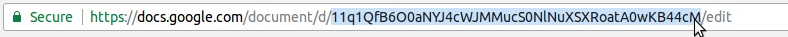
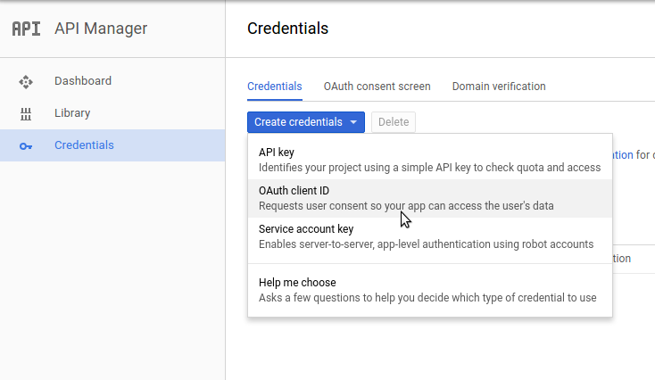
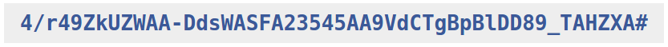

# archieml-pipe [](https://badge.fury.io/js/archieml-pipe)

archieml-pipe is a library to help easily export data structured in [ArchieML](http://archieml.org/) in Google Docs to local JSON. You can then use that data as context to render HTML templates.

We use this library in order to separate the function of writing and editing text from producing interactive content for the web in the POLITICO newsroom.

Read all about how to use [ArchieML](http://archieml.org/#demo), then see how you can use this library to easily authenticate and export structured data from Google Docs.

### Usage

Use archieml-pipe in your build system:

```javascript
const gulp = require('gulp');
const archiePipe = require('archieml-pipe').default;

const config = {
  googleDocId: '<google doc id>', // required
  googleClientId: '<google client id>', // required
  googleClientSecret: '<google client secret>', // required
  redirectPort: '6006', // defaults to 6006
  exportPath: 'path/to/save/data.json', // defaults to ./data.json
  tokenPath: 'path/to/save/token.json', // defaults to ./archie-token.json
};

gulp.task('archie', (cb) => {
    archiePipe(config);
    cb();
});
```

This example uses [Gulp](http://gulpjs.com/), but of course you can use whatever you like. Just call the function, passing it a config object with the required properties.

### Credentials

##### `googleDocId`

Simply open you doc in the browser and copy the ID from the URL:



**Don't forget** to change your share settings to **"Anyone with the link can view."**

##### `googleClientId`



1. Go to the [Google Developers Console](https://console.developers.google.com) and create a new project.

2. Create credentials for an OAuth client ID.

3. Select "Web Application" for the Application Type, and give your client a name.

4. Add `http://localhost` to Authorized JavaScript origins

5. Add `http://localhost:6006` to Authorized Redirect URIs

6. Click create and copy both the client ID and client secret.

7. Go to the Library tab in the left rail and search for the **Drive API**

8. Click it and enable the API in the next screen.

##### `googleClientSecret`

Use the client secret key you copied out of the previous step.


##### Token

On your first run, archieml-pipe will open a browser that will guide you through the Google permission dialogue to access you document, after which you will be redirected with an auth code. Copy and paste it into the prompt and archieml-pipe will save the token locally to a JSON file at `tokenPath`.




### Credits

archieml-pipe is cobbled together from several other great ArchieML libs, namely:
+ [node-archieml-boilerplate](https://github.com/stuartathompson/node-archieml-boilerplate)
+ [aml-gdoc-server](https://github.com/Quartz/aml-gdoc-server)
+ [archieml-js](https://github.com/newsdev/archieml-js/blob/master/examples/google_drive.js)

### Developing

Make changes in `src/` and then run `$ gulp` to transpile ES6 code.
